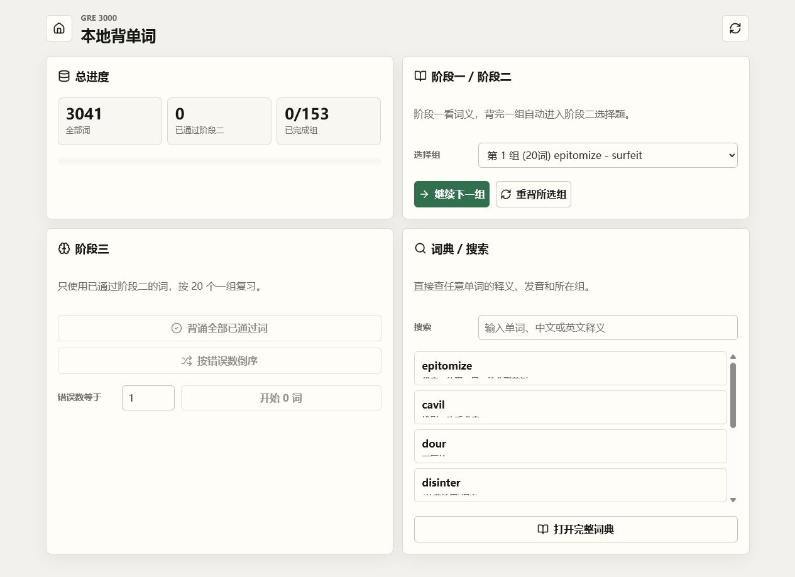
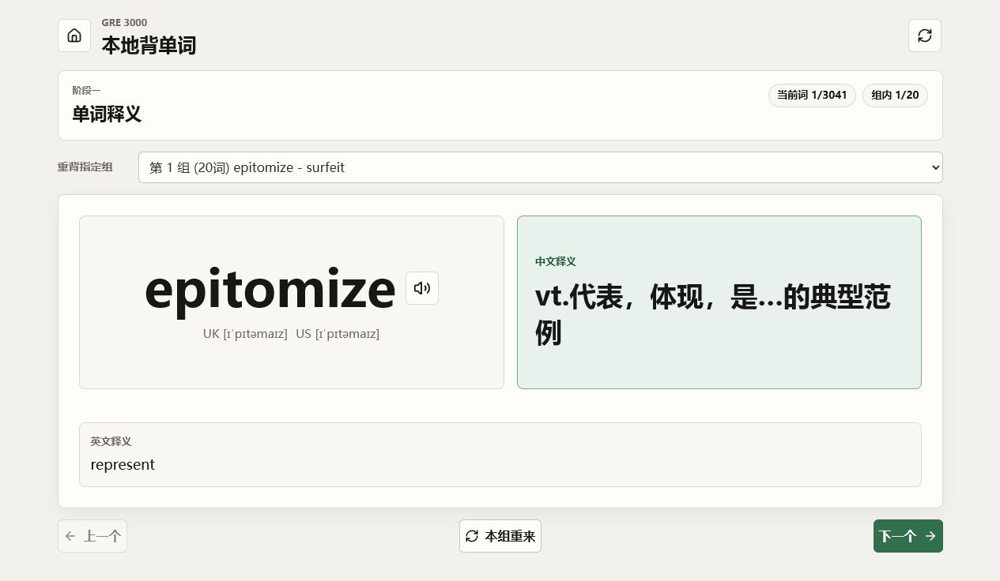
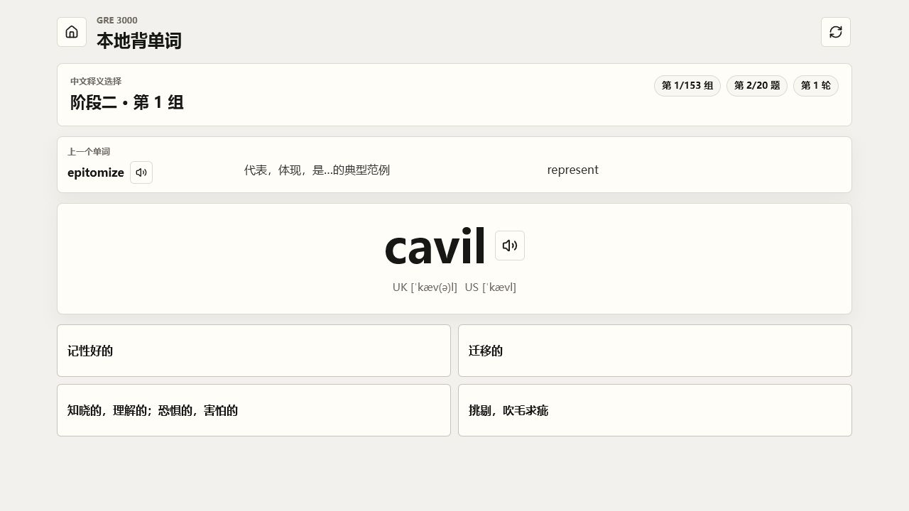
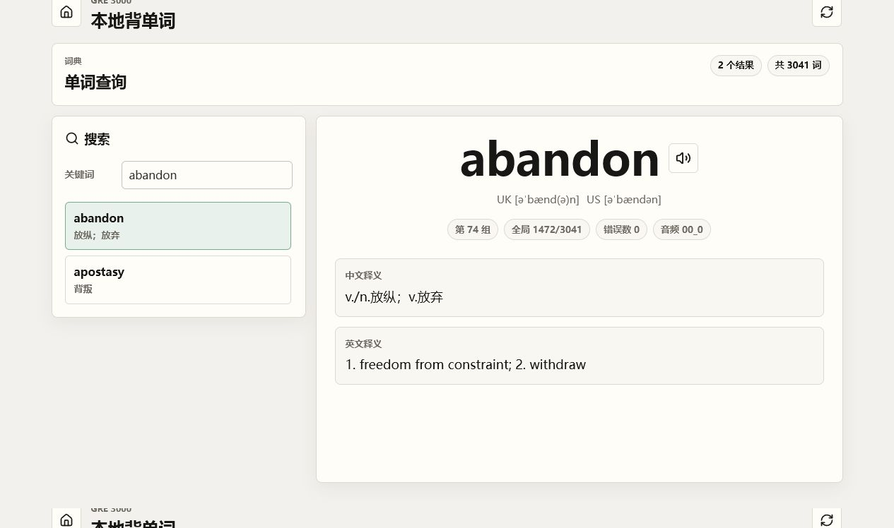

# 📚 GRE3000 Vocab App

一个本地运行的 GRE 背单词网页应用，适合在电脑或手机浏览器中使用。它把单词学习、发音、选择题复习、错题统计和词典搜索放在同一个页面里。

A local GRE vocabulary web app for desktop and mobile browsers. It combines word study, audio playback, multiple-choice review, error tracking, and dictionary search in one place.



## 🚀 快速开始 / Quick Start

如果你从源码运行应用：

If you run the app from source:

```bash
npm install
npm run dev
```

然后打开：

Then open:

```text
http://127.0.0.1:5173/
```

## 🏠 主页 / Home

主页可以查看总进度、开始阶段一/阶段二、进入阶段三复习，也可以直接搜索单词。

The home page shows your overall progress, starts Stage 1/Stage 2, opens Stage 3 review, and lets you search words directly.

常用入口：

Main actions:

- **继续下一组 / Continue next group**: 从还没完成的组开始学习。
- **重背所选组 / Restart selected group**: 重新学习指定组。
- **阶段三 / Stage 3**: 复习已经通过阶段二的单词。
- **词典 / 搜索 / Dictionary / Search**: 搜索单词、中文释义或英文释义。


## 🧠 阶段一 / Stage 1

阶段一用于建立第一印象。页面左侧显示单词、音标和发音按钮，右侧直接显示中文释义，下面显示英文释义。

Stage 1 builds the first memory impression. The word, phonetics, and audio button are on the left; the Chinese meaning is shown directly on the right; the English definition appears below.

这样设计是为了把“单词形状 + 发音 + 中文含义”固定在同一个视觉区域里。建议按这个顺序看：先看单词，听一遍发音，再看右侧中文释义，最后用英文释义确认含义。

This layout is meant to bind the word shape, pronunciation, and Chinese meaning in one visual area. A useful routine is: look at the word, listen once, read the Chinese meaning on the right, then confirm with the English definition.



操作：

Steps:

1. 进入新单词时，应用会自动播放一次发音。
2. 点击发音按钮可以重复播放。
3. 点击 **下一个 / Next** 进入下一词。
4. 背完一组后，会自动进入阶段二。

## ✅ 阶段二 / Stage 2

阶段二是中文释义选择题。页面会显示当前单词和 4 个中文释义选项，其中只有 1 个正确答案。

Stage 2 is a Chinese-meaning multiple-choice quiz. The page shows one word and four Chinese meaning options. Only one option is correct.



操作：

Steps:

1. 每进入一个新单词，应用会自动播放一次发音。
2. 根据单词选择正确的中文释义。
3. 选对后自动进入下一个词。
4. 选错后会显示正确中文释义和英文释义，并把该词错误次数加 1。
5. 本组结束后，会自动重测本组错词。
6. 直到本组全部正确，才会进入下一组阶段一。

顶部的 **上一个单词 / Previous word** 区域可以回看上一个词的中英文释义，也可以点击小喇叭重新播放上一个词的发音。

The **Previous word** area at the top lets you review the previous word's Chinese and English meanings. You can also click the small audio button to replay its pronunciation.

## 🔁 阶段三 / Stage 3

阶段三用于复习已经通过阶段二的单词。题型和阶段二一样，但只使用已通过的词。

Stage 3 reviews words that have already passed Stage 2. It uses the same quiz format as Stage 2, but only includes passed words.

可选复习方式：

Review modes:

- **背诵全部已通过词 / Review all passed words**
- **按错误数倒序 / Sort by error count**
- **错误数等于某个数值 / Review words with a specific error count**

阶段三仍然按 20 个词一组推进。答错会继续增加错误次数，背完一组后直接进入阶段三下一组。

Stage 3 still uses groups of 20 words. Wrong answers increase the error count, and finishing one group moves directly to the next Stage 3 group.

## 🔎 词典与搜索 / Dictionary & Search

主页可以直接搜索单词、中文释义或英文释义。点击搜索结果，或点击 **打开完整词典 / Open full dictionary**，可以进入详细词典页面。

You can search by word, Chinese meaning, or English definition on the home page. Click a result, or click **Open full dictionary**, to open the dictionary detail page.



词典页面会显示：

The dictionary page shows:

- 单词 / Word
- 发音按钮 / Audio button
- UK / US 音标 / UK and US phonetics
- 中文释义 / Chinese meaning
- 英文释义 / English definition
- 所在组 / Group
- 全局序号 / Global index
- 当前错误次数 / Current error count

## 💾 进度保存 / Progress Saving

学习进度保存在当前浏览器的 `localStorage` 中。

Your progress is saved in the current browser's `localStorage`.

- 关闭网页后再打开，进度仍然保留。
- 换浏览器或换设备，进度不会自动同步。
- 清除浏览器数据后，进度会丢失。
- 应用不需要账号，也不会上传你的学习数据。

- Progress remains after closing and reopening the page.
- Progress does not sync across browsers or devices.
- Clearing browser data will remove progress.
- No account is required, and your study data is not uploaded.

## 🔊 发音与自动播放 / Audio Playback

阶段一、阶段二和阶段三进入新单词时，都会尝试自动播放一次发音。

Stage 1, Stage 2, and Stage 3 try to auto-play pronunciation when a new word appears.

如果浏览器阻止自动播放，请先手动点击一次页面里的发音按钮。之后同一次浏览器会话通常就能继续播放。

If the browser blocks auto-play, click an audio button manually once. After that, audio usually works during the same browser session.

## ⚠️ 注意事项 / Notes

- 这是本地网页应用，不包含账号、云同步或后端服务。
- 手机和电脑都可以使用，但学习进度只保存在当前浏览器。
- 如果公开分享项目，请确认词表和音频素材有公开分享权限。

- This is a local web app with no account system, cloud sync, or backend service.
- It works on desktop and mobile, but progress is stored only in the current browser.
- If you share the project publicly, make sure the word list and audio files are allowed to be shared.
